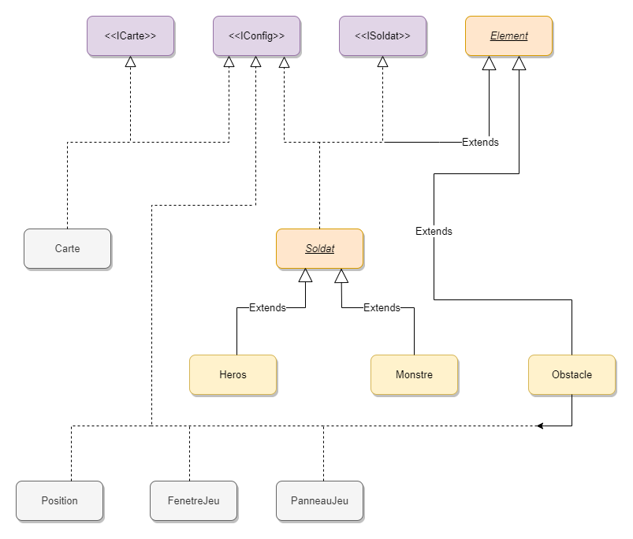

# WarStone
WarsStone est un projet de programmation de licence 3 informatique.
Le projet consiste à programmer en Java un jeu de stratégie permettant de jouer à la guerre
dans le monde (imaginaire) du seigneur des anneaux

## Présentation

On souhaite réaliser un paquetage wargame définissant des classes permettant à un général-joueur
dirigeant une armée de Heros (humains, nains, elfes, hobbits, etc.) d’affronter une armée de
Monstres (trolls, orcs, gobelins, etc.) dirigée par le général-ordinateur.

Les soldats sont disposés sur une carte représentée par une grille rectangulaire. Chaque case (position)
de la grille ne peut contenir qu’un seul élément : un soldat ou un obstacle naturel infranchissable (eau,
rocher ou forêt).

Une partie est organisée en tours de jeu. À chaque tour de jeu, le général-joueur peut ordonner à
chacun de ses soldats de se déplacer dans une des 8 cases adjacentes (à condition qu’elle soit vide),
d’attaquer un ennemi à sa portée… ou de se reposer. Quand le joueur a terminé son tour de jeu, les
monstres agissent chacun à leur tour. Si un monstre repère un héros à sa portée, il l’attaque. Sinon, il
se déplace dans une case choisie aléatoirement parmi les 8 cases adjacentes ne contenant aucun
élément (ni soldat ni obstacle naturel).

Les tours de jeu s’enchaînent jusqu’à ce qu’une des deux armées soient complètement anéantie.

(...)

**Cf: Enoncer**
## Vue d'ensemble 

### Diagramme UML

Le paquetage wargame pourra être organisé de la manière suivante :

- L’interface *IConfig* rassemble les principaux paramètres du jeu ;

- Les interfaces *ICarte* et *ISoldat* donnent les signatures des méthodes de _Carte_ et _Soldat_ ;

- La classe _Carte_ gère la carte et des éléments qui y figurent ;

- La classe _Position_ gère la position d’un élément sur la carte ;

- Les classes _Element_, _Soldat_, _Heros_, _Monstre_ et _Obstacle_ gèrent les soldats et les obstacles ;

- La classe _PanneauJeu_ gère l’affichage de la carte.

- La classe _FenetreJeu_ contient le main et affiche la carte et d’autres informations du jeu.

